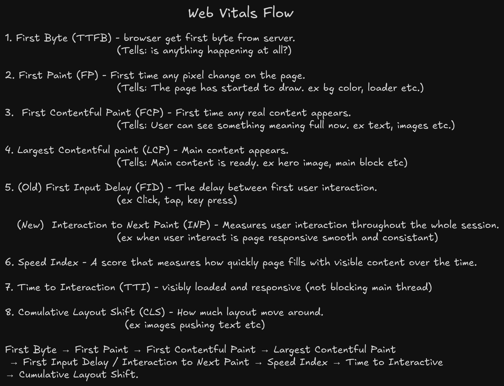
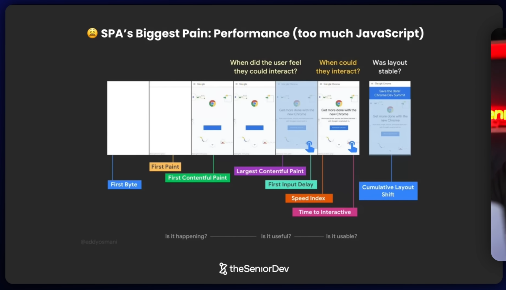
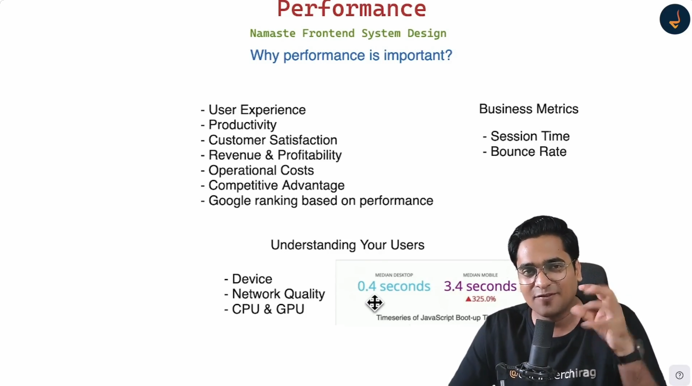
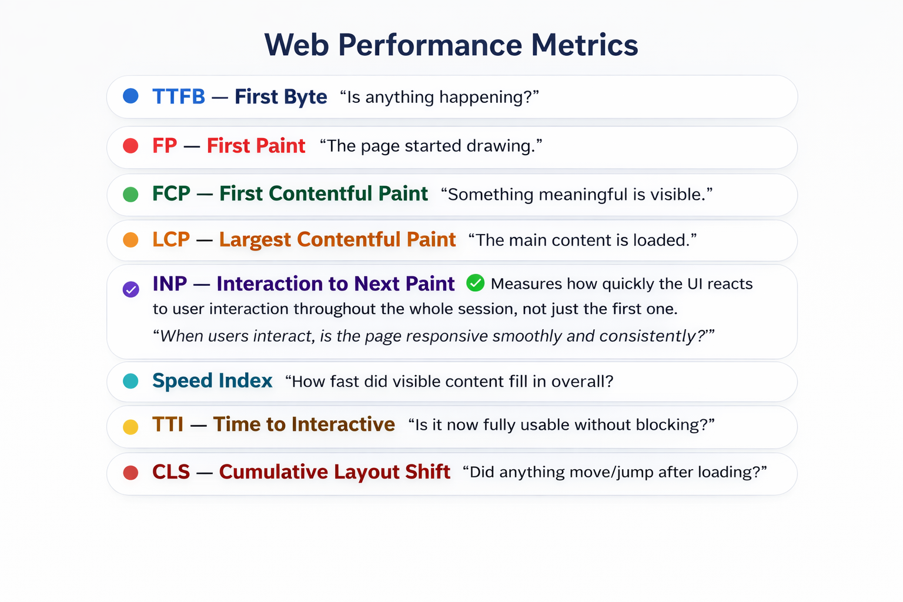
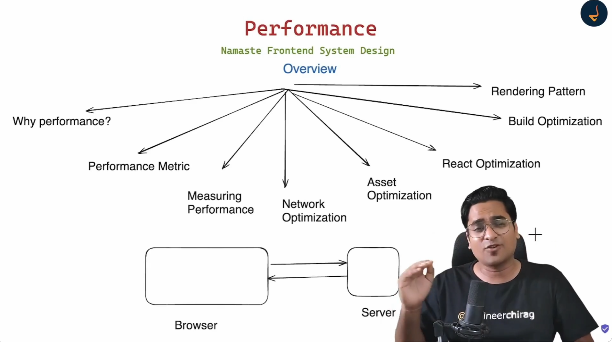
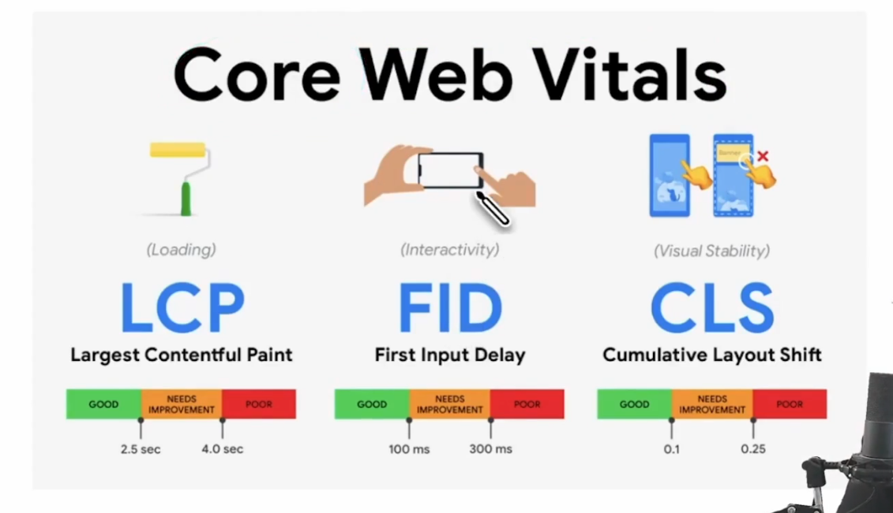
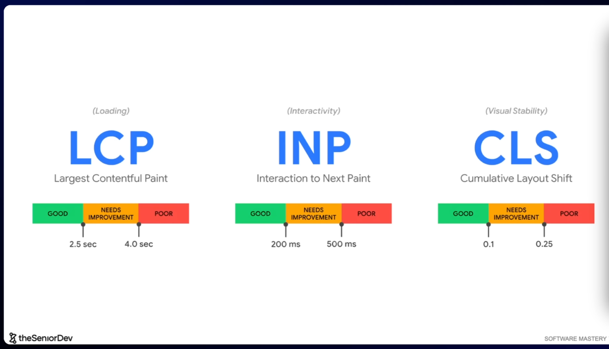
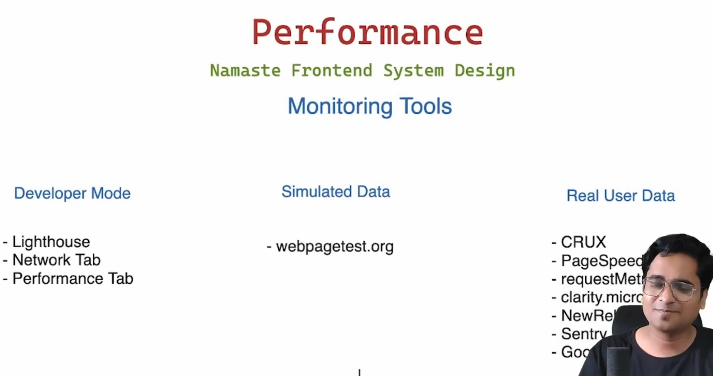

# IMP Articles

- <https://web.dev/articles/inp>

## Ref Images

## Tools

### Real User Data

- <https://pagespeed.web.dev/>
- <https://developer.chrome.com/docs/crux>
- <https://requestmetrics.com/>
- <https://clarity.microsoft.com/>
- <https://sentry.io/welcome/>
- <https://marketingplatform.google.com/about/analytics/>
- <https://newrelic.com/>

### Simulated Data

- <https://www.webpagetest.org/>

### Developer Mode

- Lighthouse Tab <https://developer.chrome.com/docs/lighthouse/overview>
- Network Tab
- Performance Tab

