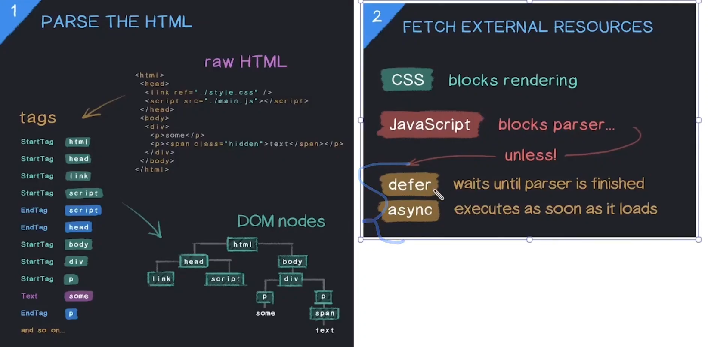
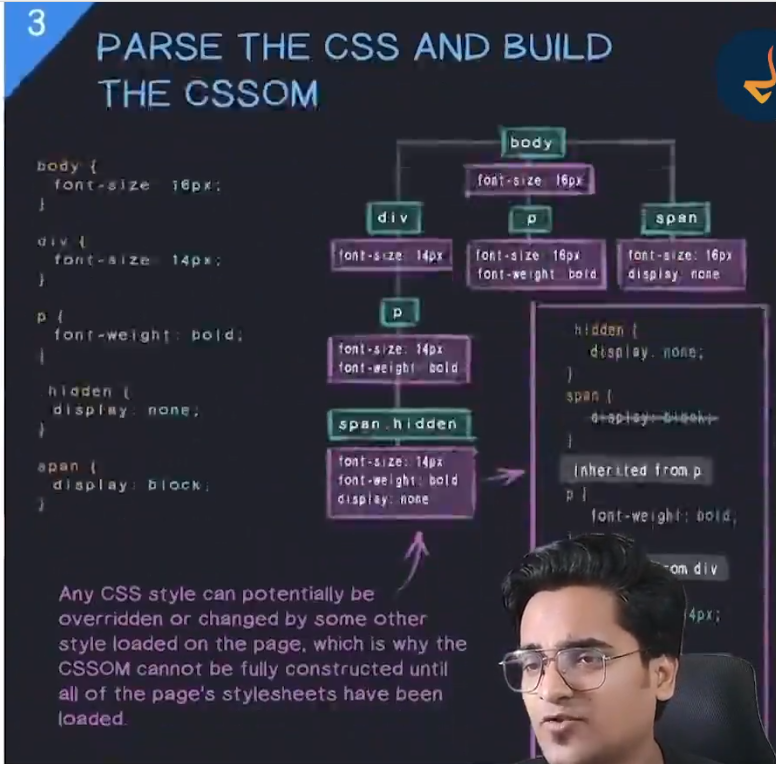
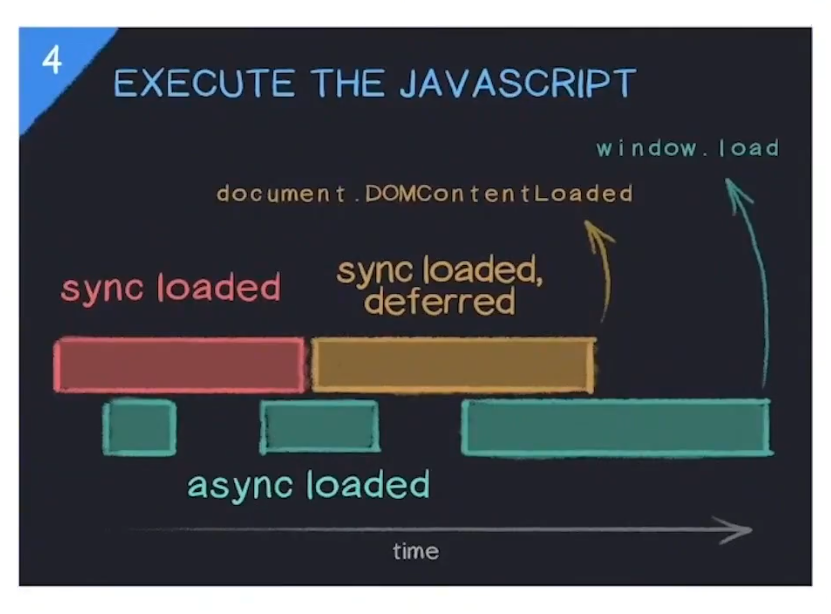
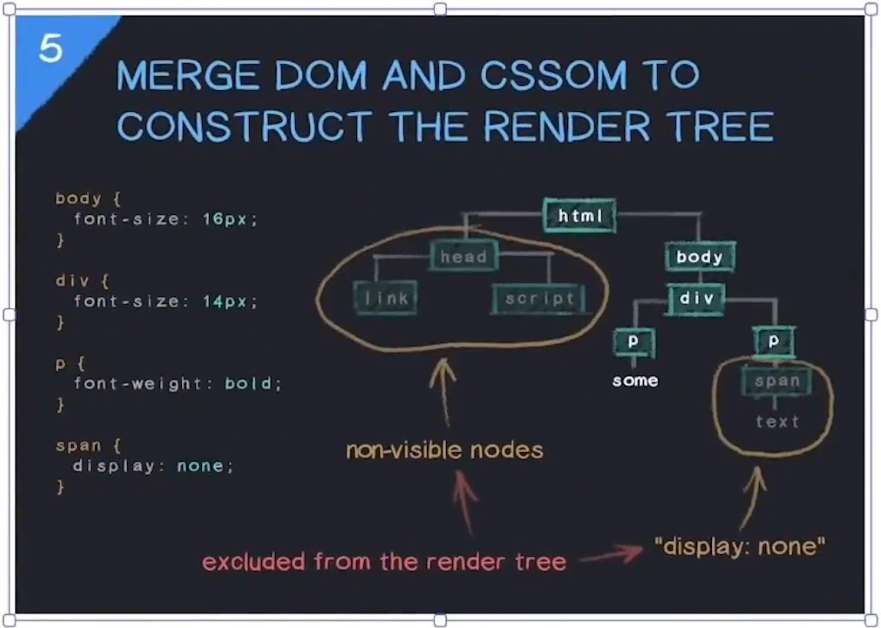
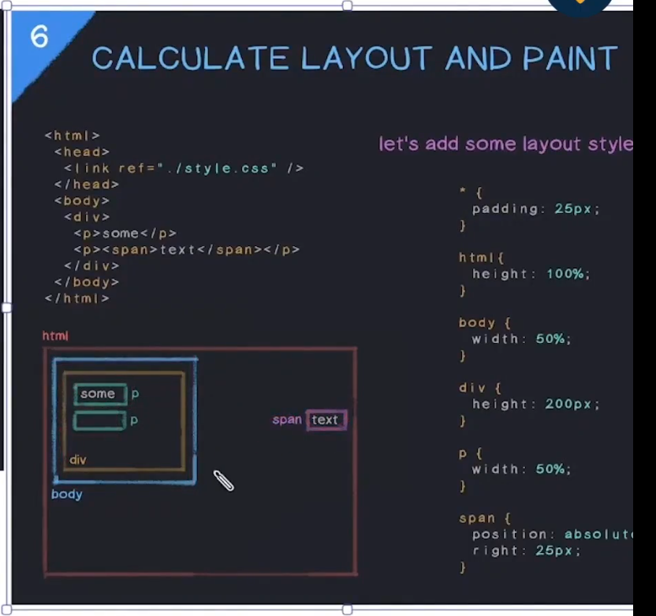

# ⚙️ How a web page renders in the browser

## 1. Parse the HTML

* Browser reads the HTML from the network.
* It tokenizes and builds the **DOM tree** node by node.
* If it encounters:

  * `<link>` → schedules CSS fetch.
  * `<script>` → may pause or continue parsing (depends on script type).

---

### 2. Fetch external resources

* While parsing, the browser starts downloading:

  * CSS files
  * JavaScript files
  * Images, fonts, etc.
* Download priority is optimized by the browser:

  * CSS is **render-blocking** (page can’t be painted until ready).
  * JS can be **parser-blocking**, **deferred**, or **asynchronous** (see next step).

---

### 3. Parse the CSS and build CSSOM

* Once CSS files arrive, the browser parses them into the **CSS Object Model (CSSOM)**.
* CSSOM represents all style rules (selectors, properties, computed values).
* Both DOM and CSSOM are needed for visual rendering.

---

### 4. Execute JavaScript

* The browser executes scripts according to their loading type:

  | Script Type           | Behavior                                                                                                     | Effect on Parsing           |
  | --------------------- | ------------------------------------------------------------------------------------------------------------ | --------------------------- |
  | **Normal `<script>`** | HTML parsing **pauses**, script **downloads and executes immediately**.                                      | **Parser-blocking**         |
  | **`defer`**           | Script **downloads in parallel**, but executes **after HTML parsing completes** (before `DOMContentLoaded`). | **Non-blocking**            |
  | **`async`**           | Script **downloads in parallel** and executes **as soon as ready**, not waiting for parsing or CSS.          | **Non-blocking, unordered** |

* During execution, JS can:

  * Modify the DOM (add/remove/change elements).
  * Inject or modify styles.
  * Trigger reflows/repaints later.

* That’s why browsers must execute blocking scripts before finalizing the render tree.

---

### 5. Merge the DOM and CSSOM to construct the Render Tree

* Once both DOM and CSSOM are ready (and blocking JS is done),
  the browser merges them into the **Render Tree** —
  which includes only **visible elements** and their computed styles.

---

### 6. Calculate layout and paint (print to screen)

* **Layout (reflow):** browser computes each element’s position and size.
* **Paint:** draws elements (colors, borders, text, images) into layers.
* **Compositing:** GPU combines layers and displays the final frame on screen.

---

# How a web page is rendered in the browser — step-by-step

## 0 — Network & resource fetching (happens before/alongside parsing)

Before the browser can parse much of anything it often has to fetch resources. This stage contains several sub-steps and is crucial to the critical rendering path.

* **DNS lookup** → find the IP for the host.
* **TCP handshake** (and **TLS handshake** for HTTPS).
* **HTTP request/response** for the HTML document (and for every external asset like CSS, JS, images, fonts).
* **Connection reuse / HTTP/2/3 multiplexing** can make multiple resources load in parallel on the same connection.
* **Caching**: browser cache, service worker cache, and CDN behaviour can supply responses immediately (short-circuiting network).
* **Priority / speculative prefetching / preconnect / preload**: browser and page hints (`<link rel="preload">`, `dns-prefetch`, `preconnect`) influence which assets are fetched first.
* **CORS preflight** only when required by cross-origin requests.
* **Blocking behavior**: external CSS and synchronous `<script>` can block rendering until fetched and processed.

---

## 1 — Parse the HTML → Build the DOM

* The browser receives the HTML bytes and **tokenizes** them into tags, text, comments.
* The **HTML parser** constructs a tree of nodes called the **DOM (Document Object Model)**.
* HTML parsing is incremental: as soon as the parser sees content it can build the DOM progressively and the browser can begin layout/paint for parts it already knows.
* **Scripts**:

  * A normal `<script src>` encountered during parsing is **parser-blocking** by default: parser stops, downloads (if not cached), executes the script, then resumes parsing.
  * `defer` scripts: downloaded in parallel and executed **after** the HTML parsing is complete, in order.
  * `async` scripts: downloaded in parallel and executed as soon as ready (may run before parsing finishes).
  * Inline scripts run immediately and can read/modify the DOM built so far.
* Errors in HTML usually result in the parser doing error-correction — DOM will be built in a well-formed manner.

---

## 2 — Fetch external resources (CSS, JS, images, fonts, etc.)

* While parsing HTML the browser discovers resource tags (`<link>`, ``, `<script>`, `@import` in CSS) and starts fetching them according to priority rules.
* **CSS** is high priority because CSS affects layout; CSS is render-blocking (the browser delays painting until CSSOM is ready).
* **JavaScript** may be render-blocking depending on `async`/`defer`/inline.
* **Fonts** and images are fetched; fonts can influence text layout (FOIT/FOUT behavior).
* Service worker may intercept and respond to requests.

---

## 3 — Parse CSS → Build the CSSOM (CSS Object Model)

* The browser parses each CSS stylesheet and inline style blocks into rules and declarations.
* Results are combined into the **CSSOM** — a representation of all style rules.
* CSS features involved:

  * Cascade, inheritance, specificity, `!important`.
  * `@import` rules can add more stylesheets (can be blocking).
  * Media queries: rules can be active/inactive depending on device viewport.
* If CSS is modified by JS (e.g., `document.styleSheets` or injecting `<style>`), the CSSOM updates.

---

## 4 — Style resolution (compute styles)

* The browser **matches CSS selectors** to DOM nodes and computes the **computed style** for each element (taking cascade, inheritance, and default UA styles into account).
* This step produces the **style data** needed for layout.
* This is sometimes referred to as “style computation” and is a distinct step between building DOM+CSSOM and layout.

---

## 5 — Construct the Render Tree (merge DOM + CSSOM)

* The browser creates a **render tree** (a.k.a. layout tree) from DOM nodes that affect visual rendering.

  * Non-visual nodes (e.g., `meta`, `script`, elements with `display: none`) are omitted.
  * Each render-tree node contains geometry-related style (display, dimensions, position, transforms, etc.).
* The render tree is what the browser uses for layout calculations (it’s DOM + styles, but stripped down for painting).

---

## 6 — Layout (a.k.a. reflow)

* The browser computes the **exact geometry** (x, y, width, height) for each node in the render tree.
* Layout is performed top-to-bottom, and depends on box model, flexbox/grid algorithms, percentages, intrinsic sizes, fonts, etc.
* Layout can be **expensive** for large trees.
* A layout pass is triggered when:

  * initial render,
  * content size changes,
  * style changes affecting geometry (e.g., `width`, `font-size`, `display`),
  * reading layout properties in JS (e.g., `getBoundingClientRect()`) can cause forced synchronous layout (layout thrash).

---

## 7 — Paint (a.k.a. rasterization)

* For each render-tree node the browser generates **display list** items: drawing commands (backgrounds, borders, text, images, shadows).
* These commands are passed to a rasterizer to convert to pixels (bitmaps).
* Painting is broken down into steps like drawing shapes, text, images, gradients — can be multi-threaded for performance.
* Painting is expensive when many pixels change.

---

## 8 — Compositing (layers, GPU acceleration)

* To optimize animations and overlapping contexts, the browser may split the page into **layers** (compositing layers).
* Each layer can be rasterized separately and then composited (combined) by the GPU.
* Compositing is much cheaper than reflow/paint and allows smooth animations if you move only layer transforms (`transform`, `opacity`) that don’t require a reflow.
* Final GPU composition produces the frame shown on screen.

---

## 9 — Display (frame presented to screen)

* The GPU presents the composited frame to the display (vsync considerations, frame rate).
* The rendering loop continues: user interactions or animations can trigger new frames (style → layout → paint → composite).

---

## 10 — JavaScript execution & reactivity (runs throughout)

* JavaScript can **read/modify the DOM or CSSOM at any time**, causing style invalidation, reflow, repaint, or re-compositing.
* The **event loop** handles timers, network callbacks, user events, microtasks (Promises), and renders between macrotasks.
* Long-running scripts block rendering and user interaction — important for time to interactive (TTI).
* `requestAnimationFrame` schedules work right before the next repaint, useful for animations.

---

## 11 — Other important bits (not obvious in the simple list)

* **Fonts**: Web fonts can block text rendering. Browsers have heuristics (FOIT: flash of invisible text; FOUT: flash of unstyled text) — font loading strategies matter.
* **Resource priorities & concurrency limits**: browser decides which resources to fetch first.
* **Progressive rendering**: browsers show parts of the page early if enough information is available (e.g., images with width/height can reserve space; otherwise layout shifts later).
* **Layout instability / Cumulative Layout Shift (CLS)** occurs when resources arrive later and change layout.
* **Accessibility tree**: the browser builds an accessibility tree derived from the DOM and ARIA attributes for assistive tech — separate from render tree but kept in sync.
* **Hit testing / event target finding**: used for pointer events and hit-testing elements on the page.
* **Garbage collection & memory management**: the JS engine cleans up objects; memory pressure can affect performance.
* **Security checks**: CSP, same-origin, mixed-content blocking, etc, can block or change how resources are fetched/executed.
* **Service workers**: can intercept requests and respond from cache or network, affecting load order.
* **Paint invalidation & incremental rendering**: the browser tries to re-paint only the changed regions, not the whole page.

---

## When reflows / repaints happen again

* Changing layout-affecting properties triggers **reflow → paint → composite**.
* Changing non-layout properties (like `opacity` or `transform`) can avoid reflow and trigger faster **composite-only** paths.
* Frequent DOM changes in a loop without batching cause layout thrashing (expensive).

---

## Metrics you’ll see in the wild (how this maps to UX)

* **First Paint (FP)**: first pixel painted.
* **First Contentful Paint (FCP)**: when the browser renders the first bit of meaningful content (text, image).
* **Largest Contentful Paint (LCP)**: when the largest visible content element loads/paints.
* **Time to Interactive (TTI)**: when page responds reliably to user input.
* **Cumulative Layout Shift (CLS)**: measure of unexpected layout shifts.

---

## Simple end-to-end sequence (condensed)

1. Browser requests HTML → DNS/TCP/TLS → receives bytes.
2. HTML parser builds DOM incrementally.
3. As HTML parses, browser discovers and fetches CSS, JS, images, fonts (with prioritization).
4. CSS parsed → CSSOM built.
5. Combine DOM + CSSOM → render tree.
6. Style resolution → layout (reflow) → paint (display list → rasterize).
7. Compositing layers → present to screen.
8. JS executes throughout and may change DOM/CSSOM, causing more style/layout/paint cycles.
9. Browser continues to handle events, animations, resource loads and incremental updates.

---
