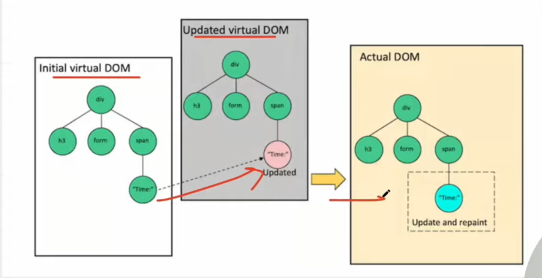
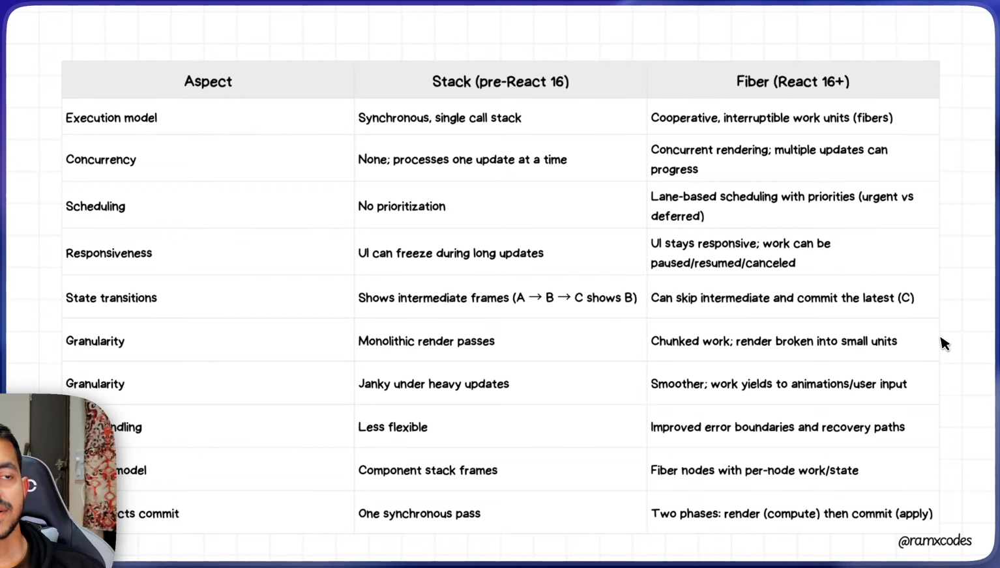
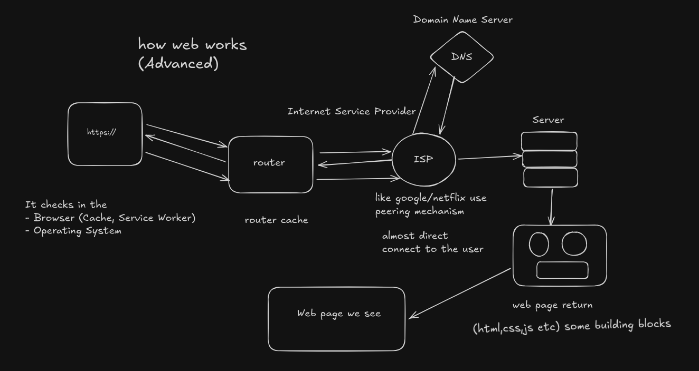

# React

## Introduction

React is a javascript library using for building user interface, especially single page applications (SPA). it lets you create reusable components, manage state, and handle update efficiently.

## Design Principle

The key points are:

- In a UI, it's not necessary for every update to be applied immediately; in fact, doing so can be wasteful, causing frames to drop and degrading the user experience.
- Different types of updates have different priorities — an animation update needs to complete more quickly than, say, an update from a data store.
- A push-based approach requires the app (you, the programmer) to decide how to schedule work. A pull-based approach allows the framework (React) to be smart and make those decisions for you.

### **Q1. What is Virtual DOM in React?**

**Answer:**
The Virtual DOM is an in-memory, lightweight representation of the UI (the real DOM). React first builds a Virtual DOM tree — call it the *Initial Virtual DOM*. When state/props change, React renders to create a new tree — the *Updated Virtual DOM*. Then React diffs (compares) the Updated Virtual DOM against the previous Virtual DOM to compute minimal changes, and applies only those changes to the *actual DOM*. This makes updating efficient and avoids unnecessary DOM operations.

---


### **Q2. What is reconciliation / diffing in React?**

**Answer:**
Reconciliation is React’s algorithm for comparing two Virtual DOM trees (old vs new) to detect what has changed. React then determines which nodes need to be added, removed, or updated, and applies only those changes to the real DOM. The diffing algorithm is optimized to run in roughly O(n) time (with heuristics) rather than naive, expensive tree-diffing algorithms. ([legacy.reactjs.org][1])
Some rules inside reconciliation:

- If component types differ (e.g. from one type to another), React replaces the entire subtree rather than diffing deeply. ([legacy.reactjs.org][1])
- For lists/arrays of children, reconciliation relies on **keys** to match items and minimize reordering or unnecessary re-renders. ([legacy.reactjs.org][1])

---

### **Q3. Why (and how) did React move from the old “Stack Reconciler” to Fiber? What is React Fiber?**

**Answer:**

- The old Stack reconciler (used in React versions before 16) was synchronous: once rendering started, it had to finish traversing and reconciling the entire component tree — which could block the main thread, cause UI jank, and degrade performance in large/complex apps. ([Medium](https://medium.com/@sattarrasouli/the-evolution-of-react-reconciliation-from-stack-to-fiber-to-the-react-compiler-9a63d08b3ad3))
- React Fiber (introduced in React 16) is a complete rewrite of React’s reconciliation engine. A “fiber” (lower-case) is an internal data structure — a JS object — representing a unit of work (component + its props/state + links to children/siblings/parent). ([Medium](https://medium.com/%40sattarrasouli/the-evolution-of-react-reconciliation-from-stack-to-fiber-to-the-react-compiler-9a63d08b3ad3))
- This architecture allows React to break the rendering into **smaller units of work**, schedule them, pause/resume them — instead of forcing a synchronous, blocking update. This enables incremental rendering, better prioritization, and more control over rendering performance. ([velotio.com](https://www.velotio.com/engineering-blog/react-fiber-algorithm?utm_source=chatgpt.com))

---



## **1️⃣ Fiber Node Structure Diagram**

```
                           ┌──────────────────────────┐
                           │        Fiber Node        │
                           └──────────────────────────┘
                                       │
          ┌─────────────────────────────┼─────────────────────────────┐
          ▼                             ▼                             ▼
   ┌─────────────┐              ┌──────────────┐              ┌──────────────────┐
   │   type      │              │   key         │              │ pendingProps      │
   └─────────────┘              └──────────────┘              └──────────────────┘
                                       │
                                       ▼
                           ┌──────────────────────────┐
                           │   memoizedProps          │
                           └──────────────────────────┘
                                       │
          ┌─────────────────────────────┼─────────────────────────────┐
          ▼                             ▼                             ▼
   ┌─────────────┐              ┌──────────────┐              ┌──────────────────┐
   │   child     │────────────►│  sibling      │────────────►│   return          │
   └─────────────┘              └──────────────┘              └──────────────────┘
                                       │
                                       ▼
                           ┌──────────────────────────┐
                           │   alternate (WIP)        │
                           └──────────────────────────┘
```

## **2️⃣ Reconciliation Flow Diagram (Virtual DOM → Fiber → Real DOM)**

```
                          State/Props Change
                                    │
                                    ▼
                         ┌──────────────────────┐
                         │  Create Updated VDOM │
                         └──────────────────────┘
                                    │
                                    ▼
                         ┌──────────────────────┐
                         │   Diff with Previous │
                         │   (Reconciliation)   │
                         └──────────────────────┘
                                    │
                                    ▼
                ┌────────────────────┴────────────────────┐
                ▼                                         ▼
     ┌──────────────────────┐                  ┌──────────────────────────┐
     │  Update Fiber Tree   │                  │  Generate Effect List    │
     └──────────────────────┘                  └──────────────────────────┘
                │                                         │
                └────────────────────┬────────────────────┘
                                     ▼
                             Commit Phase Begins
                                     ▼
                         ┌──────────────────────────┐
                         │  Apply DOM Mutations     │
                         └──────────────────────────┘
```

## **3️⃣ React Render & Commit Phases Diagram**

```
                     ┌────────────────────────────┐
                     │      Render Phase          │
                     │  (Reconciliation / Work)   │
                     └────────────────────────────┘
                                 │
                    (Interruptible / Can Pause)
                                 │
                                 ▼
                     ┌────────────────────────────┐
                     │      Commit Phase          │
                     │  (DOM mutations & Effects) │
                     └────────────────────────────┘
                                 │
                          (Not interruptible)
                                 │
                                 ▼
                       UI Updated on Screen
```

## **4️⃣ Concurrent Rendering Flow (React 18)**

```
                   ┌──────────────────────────┐
                   │   User Interaction       │
                   └──────────────────────────┘
                                │
                    High Priority? (Yes/No)
                                │
         ┌──────────────────────┼─────────────────────────┐
         ▼                                              ▼
┌──────────────────────┐                      ┌─────────────────────────┐
│  Urgent Update        │                      │ Non‑Urgent Update      │
│  (e.g. typing)        │                      │ (wrapped in transition)│
└──────────────────────┘                      └─────────────────────────┘
         │                                              │
         ▼                                              ▼
┌─────────────────────────┐                 ┌──────────────────────────┐
│ Render immediately      │                 │   Schedule in background │
└─────────────────────────┘                 └──────────────────────────┘
                                │
                         Fiber Scheduler
                                │
                                ▼
                    Commit Phase → DOM Updates
```

---

### **Q4. What improvements does React Fiber bring over the old reconciler?**

**Answer (bullet points):**

- **Incremental Rendering / Time-Slicing:** Fiber can split work into chunks and spread rendering over multiple frames instead of doing it all at once, preventing long blocking operations. ([GitHub](https://github.com/acdlite/react-fiber-architecture?utm_source=chatgpt.com))
- **Prioritization of Updates:** Fiber lets React assign priorities to different updates (e.g. user input vs background data fetching), so that urgent tasks get rendered first. ([Medium](https://medium.com/%40sattarrasouli/the-evolution-of-react-reconciliation-from-stack-to-fiber-to-the-react-compiler-9a63d08b3ad3))
- **Interruptible Rendering / Pause, Resume, Abort:** Rendering can be paused (e.g. if a higher-priority update comes in), then resumed or even discarded if no longer needed — improving responsiveness and avoiding wasted work. ([Code With Seb Blog](https://www.codewithseb.com/blog/deep-dive-into-react-fiber-the-engine-behind-modern-react?utm_source=chatgpt.com))
- **Support for New Features (Concurrent Rendering, Suspense, Lazy Loading, etc.):** Fiber is foundational for modern React features like concurrent rendering (in React 18+), Suspense for data fetching / code splitting, lazy loading components, etc. ([blog.openreplay.com](https://blog.openreplay.com/understanding-react-fiber-improves-rendering-performance/?utm_source=chatgpt.com))
- **Better Handling of Large & Complex Component Trees:** With incremental work, scheduling, and prioritization, even deeply nested or large component trees can update smoothly without blocking UI. ([Medium](https://medium.com/%40pranshu6sept/react-fiber-the-concurrent-rendering-revolution-that-changed-everything-7f17a69da5b8))
- **Improved Resilience (e.g. Error Boundaries):** Fiber simplifies error boundary behavior — making it easier to catch and handle errors gracefully without bringing down the entire app. ([NamasteDev](https://namastedev.com/blog/understanding-the-react-fiber-architecture-2/?utm_source=chatgpt.com))

---

### **Q5. What is “concurrency” (or “concurrent rendering”) in React & how does it relate to Fiber?**

**Answer:**

- In React context, concurrency refers to the ability to prepare and render multiple versions of the UI at once, in an interruptible and non-blocking way, rather than forcing one single synchronous render pass. ([React][9])
- Fiber enables concurrency under the hood: because work is broken into fibers (units of work), React can schedule them, yield control back to the main thread, handle urgent tasks (e.g. user input) first, and resume or restart lower-priority work later — this avoids blocking the UI and keeps the app responsive. ([Code With Seb Blog][5])
- With the release of React 18, concurrency (concurrent rendering) is more deeply integrated: React 18 introduced a new concurrent renderer (replacing experimental “Concurrent Mode”), along with APIs like `startTransition`, which allow marking some state updates as non-urgent (transitions), so urgent updates can interrupt ongoing non-urgent work. ([Telerik.com][10])
- Note: concurrency in React is largely an **implementation detail** — developers see it via features/APIs (e.g. Suspense, transitions), not by directly manipulating fibers. ([React][9])

**Concise Definition:** > React concurrency is React’s ability (via Fiber) to split rendering work into small, schedulable units, and to interleave or interrupt those tasks — so that high-priority work (user interactions, animations) gets handled promptly, while less critical tasks are deferred — ensuring the UI stays smooth and responsive.

---

### **Q6. What are the two phases of an update in Fiber-based React?**

**Answer:**

1. **Render (Reconciliation) Phase** — React builds a “work-in-progress” fiber tree by reconciling the new Virtual DOM (updated UI representation) with the previous one. During this phase, React determines what has changed. This phase may be incremental and interruptible. ([NamasteDev][8])
2. **Commit Phase** — Once React has determined the minimal set of changes, in this phase React applies changes to the actual DOM (or native environment), runs side-effects (e.g. lifecycle methods, hooks), and finalizes the new UI. ([React][11])

Separating these phases allows React to compute changes without blocking the UI, then commit them only when appropriate.

---

### **Q7. How should large / heavy React applications be optimized — considering Fiber / concurrency?**

**Answer (two-pronged):**

**Approach A (Leverage Fiber + concurrency):**

- Use features like `startTransition` (in React 18+) to mark non-urgent updates (e.g. data loading, list rendering) as transitions. That way, user interactions remain fast, and heavier updates happen in background without blocking UI. ([Telerik.com][10])
- Use lazy loading / code-splitting with `React.lazy()` and `Suspense` to avoid loading large modules upfront; Fiber’s scheduling and rendering model helps ensure that loading & rendering doesn’t freeze UI. ([NamasteDev][8])
- Avoid unnecessary re-renders: use memoization (`React.memo`, `useMemo`, `useCallback`), stable keys for lists to make reconciliation efficient, and reduce prop/state churn.

**Approach B (Structural & Architectural):**

- Keep components small, focused, and composable — helps Fiber diff and patch smaller subtrees rather than large monolithic ones.
- Use state management patterns properly (e.g. local state + context or a centralized store) to avoid re-rendering large component trees unnecessarily.
- Leverage pagination / virtualization (list virtualization) for large lists — to avoid rendering huge number of items in a single render pass.

---

### **Q8. What changed in recent React versions (React 18+) regarding Fiber / concurrency / rendering?**

**Answer:**

- With React 18, the old experimental “Concurrent Mode” was deprecated in favor of a more incremental adoption model: “concurrent features” are now exposed via public APIs, but concurrency remains under the hood. ([Telerik.com][10])
- React 18 introduced `startTransition`, which lets developers mark some updates as non-urgent (transitions), making UI remain responsive for urgent updates while background updates proceed. ([Telerik.com][10])
- Fiber remains the core reconciliation engine; its benefits — incremental rendering, scheduling, prioritization, interruptible rendering — continue to power React. ([blog.openreplay.com][6])
- Support for concurrent rendering + features like Suspense (for data fetching or code splitting), lazy loading, and improved hydration/SSR pipelines leverage Fiber under the hood. ([NamasteDev][8])

---

### **Q9. What is the difference between Virtual DOM, React Elements, and Fibers (internal representation)?**

**Answer:**

- **React Elements**: the immutable objects returned from render functions (or via JSX/ `React.createElement`), describing what the UI should look like (type, props, children). They’re external, developer-facing, declarative descriptions of UI. ([Medium][12])
- **Virtual DOM (informal concept)**: usually refers to the tree of React Elements: a lightweight, in-memory representation of the UI before it's translated to actual DOM. Over time React docs have moved away from “virtual DOM” as a formal term, but the idea remains. ([Medium][12])
- **Fibers (internal)**: mutable JS objects used by React Fiber reconciler under the hood. Each fiber tracks a unit of work: component type, props/state, child/sibling/parent links, effects, update queues, etc. They correspond to React elements but also hold internal metadata. They allow React to schedule work (rendering, updates), pause/resume, prioritize, and efficiently commit changes. ([Medium][2])

In short: React Elements = “what UI should look like”; Virtual DOM ≈ tree of elements (external representation); Fibers = React’s internal engine to track “work to do” and manage rendering.

---

## How Web Request Flow



